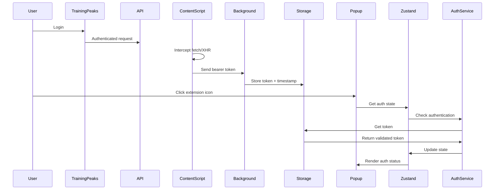

# TrainingPeaks Browser Extension - Claude AI Development Guide

**Project**: TrainingPeaks Workout Library Browser Extension
**Status**: Intervals.icu Integration Complete (Issue #90-91)
**Version**: 1.0.0
**Last Updated**: 2026-02-24

---

## Quick Start

```bash
# Install dependencies
make install

# Start development
make dev

# Run tests
make test-unit

# Build for production
make build

# Load in Chrome
make load
```

---

## Tech Stack

### Core Technologies

**Build & Development**

- **Vite 7.3.1** - Build tool with HMR (<50ms updates)
- **TypeScript 5.9.3** - Strict type safety
- **Chrome Extension Manifest V3** - Latest extension platform

**Frontend**

- **React 19.0.0** - UI library with concurrent features
- **Tailwind CSS 4.2.0** - Utility-first styling
- **@crxjs/vite-plugin 2.3.0** - Seamless Chrome extension dev

**State Management**

- **Zustand 5.0.11** - Client state (1KB, minimal API)
- **TanStack Query 5.90.21** - Server state with caching

**Validation & Type Safety**

- **Zod 4.3.6** - Runtime validation (14x faster than v3)
- **TypeScript ESLint** - Advanced linting rules

**Testing**

- **Vitest 4.0.18** - Fast unit tests with ESM
- **Playwright 1.58.2** - E2E testing (not yet implemented)
- **@testing-library/react 16.3.2** - Component testing (not yet implemented)

---

## Project Structure

```
cycling_coach_browser_plugin/
├── src/
│   ├── background/          # Service worker
│   │   ├── api/            # API client (empty, Phase 3)
│   │   ├── index.ts        # Service worker entry
│   │   └── messageHandler.ts
│   ├── content/            # Content scripts
│   │   └── tokenInterceptor.ts
│   ├── popup/              # Extension popup UI
│   │   ├── components/
│   │   ├── App.tsx
│   │   └── main.tsx
│   ├── services/           # Business logic layer
│   │   ├── authService.ts
│   │   └── storageService.ts
│   ├── store/              # Zustand state management
│   │   └── authStore.ts
│   ├── hooks/              # React custom hooks
│   │   ├── useAuth.ts
│   │   ├── useUser.ts
│   │   ├── useLibraries.ts
│   │   └── useLibraryItems.ts
│   ├── config/             # Configuration
│   │   └── queryClient.ts
│   ├── schemas/            # Zod validation schemas
│   │   └── storage.schema.ts
│   ├── types/              # TypeScript type definitions
│   │   └── index.ts
│   ├── utils/              # Shared utilities
│   │   ├── constants.ts
│   │   └── logger.ts
│   └── styles/
│       └── globals.css
├── tests/
│   ├── unit/               # Unit tests (125 tests, 100% coverage)
│   │   ├── config/        # Query client tests
│   │   ├── hooks/         # React hooks tests (24 tests)
│   │   ├── services/      # Service tests
│   │   ├── schemas/       # Zod schema tests
│   │   └── background/    # Background worker tests
│   ├── integration/        # Integration tests (empty)
│   ├── components/         # Component tests (empty)
│   ├── e2e/                # E2E tests (empty)
│   └── setup.ts            # Test configuration
├── public/
│   ├── manifest.json       # Extension manifest
│   └── icons/              # Extension icons
├── docs/                   # Architecture documentation
│   └── Issue-1-TrainingPeaks-Plugin-Architecture.md
├── dist/                   # Build output (gitignored)
├── Makefile                # Common commands
├── CLAUDE.md               # This file
├── TESTING.md              # Testing guide
└── README.md               # User documentation
```

---

## Architecture Overview

### Component Architecture

```
┌─────────────────────────────────────────────────────────────┐
│                      Browser Extension                       │
├─────────────────────────────────────────────────────────────┤
│                                                               │
│  ┌──────────────┐     ┌───────────────┐     ┌────────────┐ │
│  │   Popup UI   │────▶│  Zustand      │────▶│ Background │ │
│  │   (React)    │     │  Store        │     │  Worker    │ │
│  └──────────────┘     └───────────────┘     └────────────┘ │
│         │                     │                     │        │
│         ▼                     ▼                     ▼        │
│  ┌──────────────┐     ┌───────────────┐     ┌────────────┐ │
│  │   Hooks      │     │   Services    │     │  Storage   │ │
│  │  (useAuth)   │     │  (auth, API)  │     │  (chrome)  │ │
│  └──────────────┘     └───────────────┘     └────────────┘ │
│                                                               │
├─────────────────────────────────────────────────────────────┤
│                      Content Script                           │
│              (Token Interceptor on TP domain)                │
└─────────────────────────────────────────────────────────────┘
         │
         ▼
┌─────────────────────────────────────────────────────────────┐
│              TrainingPeaks API (tpapi.trainingpeaks.com)     │
└─────────────────────────────────────────────────────────────┘
```

### Data Flow

1. **User visits TrainingPeaks** → Content script intercepts API requests
2. **Token found** → Message sent to background worker
3. **Background stores token** → chrome.storage.local (encrypted by browser)
4. **User opens popup** → Zustand checks auth state via services
5. **Services query storage** → Zod validates data
6. **UI updates** → Shows authentication status

### Authentication Flow



---

## Current Implementation Status

### ✅ Completed (Phases 1-5)

**Phase 1: Project Foundation**

- ✅ Vite + TypeScript + React setup
- ✅ Chrome Extension Manifest V3 configured
- ✅ Tailwind CSS with modern PostCSS
- ✅ Development environment (Husky, lint-staged, commitlint)
- ✅ ESLint + Prettier + TypeScript strict mode

**Phase 2: Authentication & Token Management**

- ✅ Content script token interception (fetch + XHR)
- ✅ Background service worker
- ✅ Storage service with Zod validation
- ✅ Auth service with 24-hour expiration
- ✅ Zustand auth store
- ✅ AuthStatus UI component

**Phase 3: API Integration** (Issues #10-13, #35-40)

- ✅ TypeScript interfaces for TrainingPeaks API responses
- ✅ Zod schemas for API validation (user, libraries, library items)
- ✅ API service layer in `src/background/api/trainingPeaks.ts`
- ✅ React Query configuration with Chrome extension optimizations
- ✅ Custom hooks: `useUser`, `useLibraries`, `useLibraryItems`
- ✅ Type-safe chrome.runtime.sendMessage with generics
- ✅ 125 unit tests with 100% coverage

**Phase 4: Intervals.icu Integration** (Issues #90)

- ✅ Type system redesign (library-based, no dates)
- ✅ Zod schemas for Intervals.icu API (57 tests)
- ✅ API client implementation (33 tests)
- ✅ Export adapter (24 tests)
- ✅ API key management service (25 tests)
- ✅ IntervalsApiKeyBanner component
- ✅ Multi-library export dialog
- ✅ Folder creation and organization
- ✅ 139 tests with >95% coverage

**Phase 5: Testing & Validation** (Issue #91)

- ✅ Fixed athlete_id schema validation bug
- ✅ All 139 Intervals.icu tests passing
- ✅ 100% coverage on schemas, services, adapter
- ✅ 97.72% coverage on API client
- ✅ TypeScript compilation: 0 errors
- ✅ Production build successful
- ✅ Comprehensive test results documentation

**Phase 6: Documentation Updates** (Issue #91)

- ✅ README.md updated with library-based export guide
- ✅ INTERVALSICU_INTEGRATION.md comprehensive guide
- ✅ CLAUDE.md architecture patterns documented
- ✅ Test results documentation (PHASE_5_TEST_RESULTS.md)

**API Endpoints Implemented**:

**TrainingPeaks API**:

1. ✅ `GET /users/v3/user` - User profile
2. ✅ `GET /exerciselibrary/v2/libraries` - Library list
3. ✅ `GET /exerciselibrary/v2/libraries/{id}/items` - Library content

**Intervals.icu API**:

1. ✅ `POST /athlete/0/folders` - Create workout folder
2. ✅ `POST /athlete/0/workouts` - Create workout template

### ⏳ Future Enhancements

**UI Component Testing**

- ⏳ React Testing Library tests for UI components
- ⏳ E2E tests with Playwright
- ⏳ Integration tests for message handlers

**Additional Features**

- ⏳ OAuth 2.0 authentication for Intervals.icu
- ⏳ Structured workout parsing (intervals preservation)
- ⏳ Selective workout export
- ⏳ Sync status tracking

---

## Development Guidelines

### Code Style

**TypeScript**

- ✅ Strict mode enabled
- ✅ Explicit return types on functions
- ✅ No `any` types (enforced by ESLint)
- ✅ Prefer `interface` over `type` for object shapes
- ✅ Use `const` assertions for literal types

**React**

- ✅ Function components only
- ✅ Explicit return type: `ReactElement`
- ✅ Custom hooks for business logic
- ✅ No prop drilling (use Zustand for shared state)

**Imports**

- ✅ Use `@/` path aliases (not relative paths)
- ✅ Group imports: external → internal → types
- ✅ Named exports preferred over default

**Logging**

- ✅ Use `logger` utility (not console.log)
- ✅ Dev-only logging: `logger.info()`, `logger.debug()`
- ✅ Always log errors: `logger.error()`

### Clean Code Principles Applied

**SOLID**

- **Single Responsibility**: Each service/component has one purpose
- **Dependency Inversion**: UI depends on abstractions (hooks)

**DRY**

- Shared types in `src/types/`
- Reusable components
- Constants in `src/utils/constants.ts`

**KISS**

- Minimal dependencies
- Straightforward data flow
- No premature optimization

**YAGNI**

- Only Milestone 1 features implemented
- Advanced features deferred to future phases

### Testing Strategy

**Test Pyramid**

```
       /\
      /E2E\      ← Playwright (future)
     /------\
    /  INT   \   ← Integration tests (future)
   /----------\
  /   UNIT     \ ← Vitest (22 tests, 100% coverage)
 /--------------\
```

**Coverage Goals**

- Services: >90% (currently 100%)
- Components: >80% (not yet implemented)
- Overall: >80% (currently 100% on services)

**Test Naming**

```typescript
describe('serviceName', () => {
  describe('methodName', () => {
    it('should do expected behavior when condition', () => {
      // Arrange → Act → Assert
    });
  });
});
```

---

## Important Configuration

### Path Aliases

All imports use `@/` prefix:

```typescript
// ❌ Bad
import { useAuth } from '../../hooks/useAuth';

// ✅ Good
import { useAuth } from '@/hooks/useAuth';
```

Configured in:

- `tsconfig.json` → `paths: { "@/*": ["./src/*"] }`
- `vite.config.ts` → `alias: { '@': path.resolve(...) }`
- `vitest.config.ts` → `alias: { '@': path.resolve(...) }`

### Environment Variables

**Development** (`npm run dev`):

- `import.meta.env.DEV = true`
- Logger outputs to console
- HMR enabled

**Production** (`npm run build`):

- `import.meta.env.DEV = false`
- Logger silent (except errors)
- Optimized bundle

### Chrome Storage

**Keys Used**:

```typescript
const STORAGE_KEYS = {
  AUTH_TOKEN: 'auth_token', // Bearer token string
  TOKEN_TIMESTAMP: 'token_timestamp', // Unix timestamp (ms)
};
```

**Validation**: All storage reads go through Zod schemas

### Constants

Defined in `src/utils/constants.ts`:

```typescript
API_BASE_URL = 'https://tpapi.trainingpeaks.com';
TOKEN_EXPIRY_MS = 24 * 60 * 60 * 1000; // 24 hours
EXTENSION_NAME = 'TrainingPeaks Library Access';
```

---

## API Information

### TrainingPeaks API Endpoints

**Base URL**: `https://tpapi.trainingpeaks.com`

**Authentication**: Bearer token (intercepted from user session)

**Required Headers**:

```http
Authorization: Bearer {token}
Content-Type: application/json
Origin: https://app.trainingpeaks.com
```

**Endpoints (Phase 3)**:

1. **Get User Info**

   ```
   GET /users/v3/user
   Response: { id, email, firstName, lastName, timeZone }
   ```

2. **List Libraries**

   ```
   GET /exerciselibrary/v2/libraries
   Response: [{ id, name, ownerId, ownerName, itemCount, isShared }]
   ```

3. **Get Library Items**
   ```
   GET /exerciselibrary/v2/libraries/{id}/items
   Response: { items: [{ id, name, description, type, duration }] }
   ```

---

## React Query Patterns

### State Management Strategy

We maintain **strict separation** between two types of state:

**Server State (React Query)** - Data from TrainingPeaks API:

- User profile (`useUser`)
- Libraries list (`useLibraries`)
- Library items (`useLibraryItems`)

**Client State (Zustand)** - Local application state:

- Authentication status (`useAuth` - existing)
- UI preferences (future)
- Form state (future)

### Custom Hooks

**useUser Hook** - Fetch user profile data:

```typescript
import { useUser } from '@/hooks/useUser';

function UserProfile() {
  const { data: user, isLoading, error } = useUser();

  if (isLoading) return <div>Loading...</div>;
  if (error) return <div>Error: {error.message}</div>;
  if (!user) return null;

  return <div>Hello, {user.firstName}!</div>;
}
```

**useLibraries Hook** - Fetch libraries list:

```typescript
import { useLibraries } from '@/hooks/useLibraries';

function LibraryList() {
  const { data: libraries, isLoading, error, refetch } = useLibraries();

  if (isLoading) return <LoadingSpinner />;
  if (error) return <ErrorMessage error={error} onRetry={refetch} />;
  if (!libraries?.length) return <EmptyState />;

  return (
    <ul>
      {libraries.map(lib => (
        <LibraryCard key={lib.exerciseLibraryId} library={lib} />
      ))}
    </ul>
  );
}
```

**useLibraryItems Hook** - Fetch library items (parameterized):

```typescript
import { useLibraryItems } from '@/hooks/useLibraryItems';

function LibraryDetails({ libraryId }: { libraryId: number }) {
  const { data: items, isLoading, error } = useLibraryItems(libraryId);

  if (isLoading) return <LoadingSpinner />;
  if (error) return <ErrorMessage error={error} />;
  if (!items?.length) return <EmptyLibrary />;

  return (
    <div>
      <h2>{items.length} Workouts</h2>
      <WorkoutGrid items={items} />
    </div>
  );
}
```

**Conditional Fetching** - Lazy loading with `enabled` option:

```typescript
function LibraryPreview({ libraryId }: { libraryId: number }) {
  const { data, refetch } = useLibraryItems(libraryId, { enabled: false });

  return (
    <div>
      <button onClick={() => refetch()}>Load Workouts</button>
      {data && <WorkoutList items={data} />}
    </div>
  );
}
```

### Query Configuration

**Query Client Settings** (`src/config/queryClient.ts`):

- `staleTime: 5min` - Default cache freshness
- `gcTime: 10min` - Memory cleanup (keeps data for popup re-opens)
- `retry: 2` - Exponential backoff for network errors
- `refetchOnWindowFocus: true` - Validate on popup focus
- `refetchOnReconnect: true` - Refetch when network reconnects
- `refetchOnMount: false` - Trust cache on re-open

**Per-Hook Overrides**:

- `useUser`: `retry: 1` (auth failures shouldn't spam)
- `useLibraries`: `staleTime: 10min` (libraries change infrequently)
- `useLibraryItems`: `staleTime: 3min` (items may be edited more often)

### Message Passing Pattern

All API calls use type-safe `chrome.runtime.sendMessage`:

```typescript
// Type-safe message definition (src/types/index.ts)
export interface GetUserMessage {
  type: 'GET_USER';
}

// Custom hook sends message
const response = await chrome.runtime.sendMessage<
  GetUserMessage,
  ApiResponse<UserProfile>
>({ type: 'GET_USER' });

// Background handler processes
case 'GET_USER':
  return await fetchUser(); // Returns ApiResponse<UserProfile>
```

### Cache Invalidation

**Manual Invalidation**:

```typescript
import { useQueryClient } from '@tanstack/react-query';

const queryClient = useQueryClient();

// Invalidate all queries
queryClient.invalidateQueries();

// Invalidate specific queries
queryClient.invalidateQueries(['user']);
queryClient.invalidateQueries(['libraries']);
queryClient.invalidateQueries(['libraries', 123, 'items']);
```

**Hierarchical Query Keys**:

- `['user']` - User profile
- `['libraries']` - All libraries
- `['libraries', libraryId, 'items']` - Specific library items

Invalidating `['libraries']` will invalidate all library-related queries.

### Error Handling

**Layered Approach**:

1. **Background Worker** - Catches fetch errors, validates with Zod
2. **Query Functions** - Unwraps `ApiResponse<T>`, throws on error
3. **Custom Hooks** - Exposes React Query error state
4. **UI Components** - Displays user-friendly messages

```typescript
// In custom hooks
if (response.success) {
  return response.data;
} else {
  throw new Error(response.error.message); // Triggers React Query error state
}

// In UI components
if (error) {
  return <ErrorMessage error={error} onRetry={refetch} />;
}
```

---

## Export Adapters

### Intervals.icu Export Adapter

**Pattern**: Library-based export (templates, not calendar events)

The Intervals.icu integration exports TrainingPeaks workout libraries as reusable templates in Intervals.icu, organized in folders. Workouts are saved without dates, allowing flexible scheduling later.

**Key Files**:

- `src/export/adapters/intervalsicu/IntervalsIcuAdapter.ts` - Adapter implementation
- `src/background/api/intervalsicu.ts` - API client
- `src/types/intervalsicu.types.ts` - Type definitions
- `src/schemas/intervalsicu.schema.ts` - Zod validation schemas

**Architecture**:

1. **Create Folder** (optional): `POST /athlete/0/folders`
2. **Export Workouts**: `POST /athlete/0/workouts` (individual requests)
3. **No Dates**: Workouts saved as templates for later scheduling

**Config Interface**:

```typescript
interface IntervalsIcuExportConfig {
  apiKey: string; // User's Intervals.icu API key
  libraryName: string; // Folder name (from TrainingPeaks library)
  createFolder?: boolean; // Create folder or use existing
  description?: string; // Optional folder description
}
```

**Usage**:

```typescript
import { IntervalsIcuAdapter } from '@/export/adapters/intervalsicu';

const adapter = new IntervalsIcuAdapter();

const config: IntervalsIcuExportConfig = {
  apiKey: 'user_api_key',
  libraryName: 'Cycling Base Training',
  createFolder: true,
  description: 'Base training workouts for cycling',
};

// Transform library items to Intervals.icu format
const workouts = await adapter.transform(items, config);
// Returns: IntervalsWorkoutResponse[] (templates, not events)

// Validate results
const validation = adapter.validate(workouts);
if (!validation.valid) {
  console.error('Export failed:', validation.errors);
}

// Get export summary
const result = adapter.export(workouts, config);
console.log(
  `Exported ${result.count} workouts to folder: ${result.destination}`
);
```

**Key Differences from Calendar-Based Export**:

- No `start_date_local` field in workout payloads
- Uses `/folders` and `/workouts` endpoints (not `/events/bulk`)
- Workouts organized by `folder_id` instead of dates
- Users schedule workouts in Intervals.icu by dragging to calendar

**API Endpoints**:

```typescript
// Get current athlete (fetch real athlete ID)
GET /api/v1/athlete/0
Response: { id: 12345, name: "Athlete Name", email: "..." }

// Create folder (uses real athlete ID)
POST /api/v1/athlete/{athleteId}/folders
{
  "name": "Cycling Base Training",
  "description": "Base training workouts"
}

// Create workout template (uses real athlete ID)
POST /api/v1/athlete/{athleteId}/workouts
{
  "category": "WORKOUT",
  "type": "Ride",
  "name": "Sweet Spot Intervals",
  "description": "4x10min @ 88-93% FTP\n\n**Coach Notes:**...",
  "moving_time": 3600,
  "icu_training_load": 85,
  "folder_id": 123  // Optional folder organization
}
```

**Note**: The integration first calls `GET /athlete/0` to fetch the current user's athlete ID, then uses that real ID (`/athlete/{athleteId}/`) in folder and workout API calls.

**Error Handling**:

```typescript
// API client returns ApiResponse<T>
const result = await createIntervalsWorkout(payload);

if (result.success) {
  console.log('Created workout:', result.data.id);
} else {
  // Handle errors: NO_API_KEY, INVALID_API_KEY, EXPORT_ERROR, API_ERROR
  console.error('Export failed:', result.error.message);
}
```

**Testing**:

- 100% coverage on adapter, API client, and schemas
- 139 total tests for Intervals.icu integration
- Tests located in `tests/unit/export/adapters/intervalsicu/`

---

## Common Tasks

### Adding a New Service

1. Create file in `src/services/myService.ts`
2. Export functions with explicit return types
3. Import from `@/services/myService`
4. Create tests in `tests/unit/services/myService.test.ts`
5. Run `make test-unit` to verify

### Adding a New Component

1. Create in `src/popup/components/MyComponent.tsx`
2. Use `ReactElement` return type
3. Import hooks from `@/hooks/`
4. Use Tailwind for styling
5. Export as named export

### Adding a Zod Schema

1. Create in `src/schemas/mySchema.ts`
2. Define schema: `export const MySchema = z.object({...})`
3. Export inferred type: `export type MyType = z.infer<typeof MySchema>`
4. Use `MySchema.parse(data)` for validation

### Running Quality Checks

```bash
make check        # Lint + Type check
make test-unit    # Run tests
make coverage     # Coverage report
make pre-commit   # Full pre-commit check
```

---

## Troubleshooting

### Extension Not Loading

**Issue**: Chrome rejects the extension
**Fix**:

```bash
make clean
make build
# Reload in chrome://extensions
```

### Tests Failing

**Issue**: Chrome API not mocked
**Fix**: Check `tests/setup.ts` has all needed mocks

**Issue**: Import errors with `@/`
**Fix**: Ensure `vitest.config.ts` has path alias configured

### Build Errors

**Issue**: TypeScript errors
**Fix**: `make type-check` for details

**Issue**: Vite build fails
**Fix**: Check `vite.config.ts` manifest path

### Token Not Intercepting

**Issue**: Extension doesn't detect TrainingPeaks login
**Fix**:

- Check you're on `app.trainingpeaks.com`
- Open DevTools → Console for content script logs
- Trigger an API request (click around TrainingPeaks)

---

## Performance Budget

- **Bundle Size**: <2MB total (currently 254KB ✅)
- **Popup Open**: <200ms (currently <50ms ✅)
- **Extension Load**: <500ms initialization
- **Test Execution**: <5s for unit tests (currently 1.15s ✅)

---

## Security Considerations

**Token Storage**

- ✅ Use `chrome.storage.local` (encrypted by browser)
- ✅ Never log tokens in production
- ✅ No token transmission to third parties

**Permissions**

- ✅ Minimal required permissions only
- ✅ Host permissions restricted to TrainingPeaks domains

**CSP**

- ✅ Strict Content Security Policy
- ✅ No inline scripts
- ✅ No `eval()` or remote code execution

---

## Links & References

**GitHub Issues**: [Issue #1](https://github.com/eduardoarantes/cycling_coach_browser_plugin/issues/1)
**Architecture**: `docs/Issue-1-TrainingPeaks-Plugin-Architecture.md`
**Testing Guide**: `TESTING.md`
**User Guide**: `README.md`

**External Docs**:

- [Chrome Extension Docs](https://developer.chrome.com/docs/extensions/)
- [Manifest V3 Guide](https://developer.chrome.com/docs/extensions/mv3/intro/)
- [Vite Docs](https://vitejs.dev/)
- [React Query Docs](https://tanstack.com/query/latest)
- [Zustand Docs](https://github.com/pmndrs/zustand)

---

## Next Steps for Development

**Immediate (Phase 3)**:

1. Create API type definitions in `src/types/api.types.ts`
2. Create Zod schemas for API responses in `src/schemas/`
3. Implement API service in `src/background/api/trainingPeaks.ts`
4. Configure React Query in popup
5. Create custom hooks for data fetching
6. Test API integration with real TrainingPeaks account

**See**: Issues #10-13 on GitHub for detailed tasks

---

**Last Updated**: 2026-02-20
**Maintained By**: Claude Sonnet 4.5
**For Questions**: See README.md or architecture documentation
