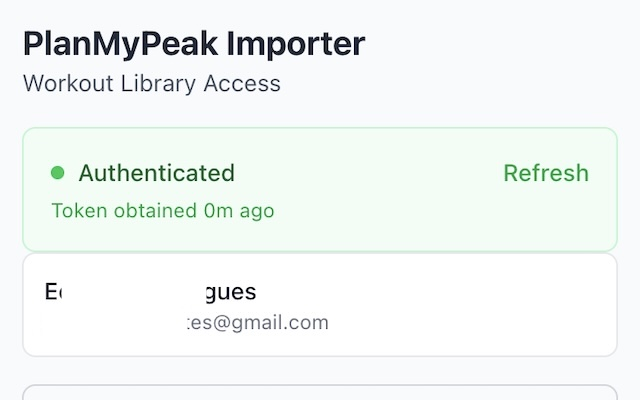

# PlanMyPeak Importer

Open-source Chrome extension for working with TrainingPeaks data in the browser.
It captures your authenticated TrainingPeaks session locally, lets you browse
workout libraries and training plans, and exports data to PlanMyPeak and
Intervals.icu.

This project is independent and is not affiliated with TrainingPeaks,
Intervals.icu, or PlanMyPeak.



## What It Does

- Reuses your existing TrainingPeaks web session instead of asking you to paste
  tokens manually
- Browses TrainingPeaks workout libraries, workouts, plans, notes, and events
- Exports workout libraries and full training plans to PlanMyPeak
- Exports workout libraries and reusable PLAN folders to Intervals.icu
- Tracks export progress with extension badge updates and Chrome notifications

## Supported Platforms

- Chrome and Chromium-based browsers
- TrainingPeaks is required
- PlanMyPeak is optional
- Intervals.icu is optional

Firefox and Safari are not supported.

## Privacy at a Glance

- The extension stores credentials and settings in `chrome.storage.local`
- Network calls go directly from the extension to provider APIs
- There is no analytics, ads, or separate telemetry backend in this repository
- PlanMyPeak and Intervals.icu are optional integrations; see the privacy docs
  for the exact request paths and conditions

See [PRIVACY.md](./PRIVACY.md) and
[docs/PRIVACY_AND_PERMISSIONS.md](./docs/PRIVACY_AND_PERMISSIONS.md) for the
full details.

## Install From Source

1. Install dependencies:

   ```bash
   npm install
   ```

2. Build the extension bundle without changing the version number:

   ```bash
   npm run build:bundle
   ```

3. Open `chrome://extensions`.
4. Enable `Developer mode`.
5. Click `Load unpacked`.
6. Select the repository's `dist/` directory.

### First Use

1. Open `https://app.trainingpeaks.com` and sign in.
2. Refresh the page or navigate inside TrainingPeaks to trigger API requests.
3. Open the extension popup.
4. Confirm that TrainingPeaks shows as connected.
5. Optionally connect PlanMyPeak or add an Intervals.icu API key in Settings.

For a more detailed guide, see [INSTALL.md](./INSTALL.md).

## Development

```bash
npm install
npm run dev
npm run lint
npm run type-check
npm run test:unit
```

Useful commands:

- `npm run dev`: local development target for PlanMyPeak (`localhost:3006`)
- `npm run dev:prod`: development server targeting production hosts
- `npm run build:bundle`: production-target bundle without a version bump
- `npm run build`: production-target bundle and patch-version increment
- `npm run build:local`: local-target bundle and patch-version increment
- `npm run test:e2e`: Playwright extension tests in headed Chromium

Important: `npm run build` and `npm run build:local` update the patch version in
`package.json` and `public/manifest.json` via `scripts/increment-version.cjs`.
For routine local validation, prefer `npm run build:bundle`.

## Project Layout

```text
src/
  background/   Service worker and provider API clients
  content/      TrainingPeaks and PlanMyPeak request interceptors
  export/       Destination adapters and mapping logic
  hooks/        Popup data-fetching and auth hooks
  popup/        React UI for browsing and exports
  schemas/      Zod schemas
  services/     Storage, auth, export progress, and port config
tests/
  unit/         Unit tests
  components/   Component tests
  e2e/          Playwright extension tests
docs/
  Architecture, mapping, and integration notes
```

## Documentation

- [INSTALL.md](./INSTALL.md)
- [CONTRIBUTING.md](./CONTRIBUTING.md)
- [TESTING.md](./TESTING.md)
- [PRIVACY.md](./PRIVACY.md)
- [SECURITY.md](./SECURITY.md)
- [docs/ARCHITECTURE.md](./docs/ARCHITECTURE.md)
- [docs/PRIVACY_AND_PERMISSIONS.md](./docs/PRIVACY_AND_PERMISSIONS.md)

## Current Limitations

- Token capture depends on visiting supported TrainingPeaks pages and generating
  authenticated network traffic
- Playwright extension tests must run in headed Chromium
- The packaged extension name is currently `PlanMyPeak Importer`
- Production bundles target `planmypeak.com`; local dev bundles can target a
  configurable localhost PlanMyPeak app and Supabase instance

## License

MIT. See [LICENSE](./LICENSE).
