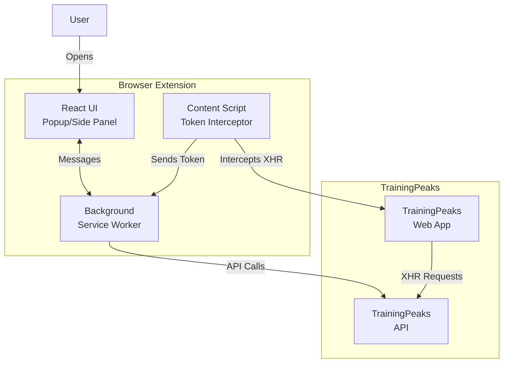
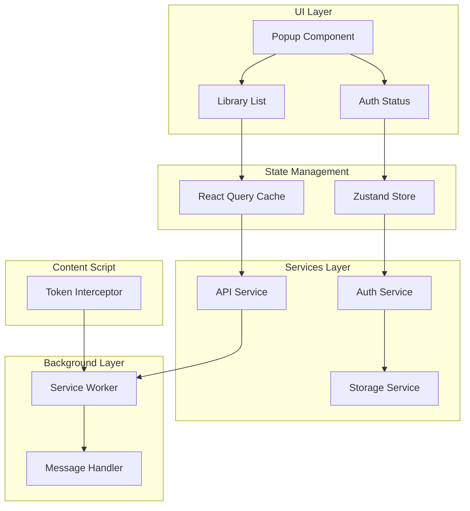
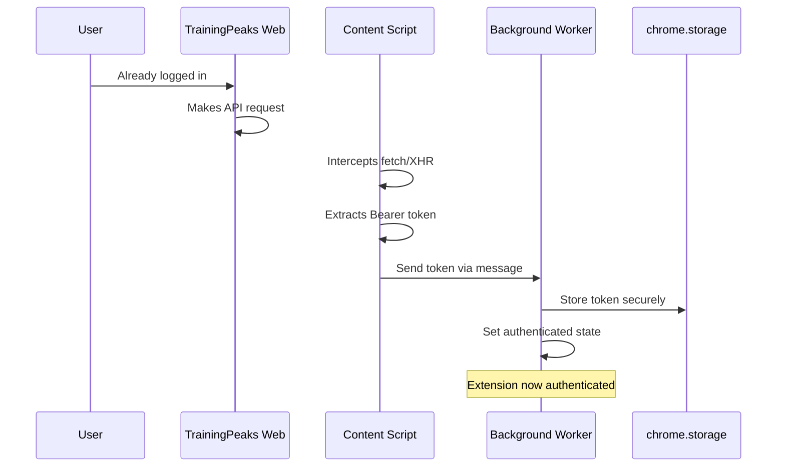
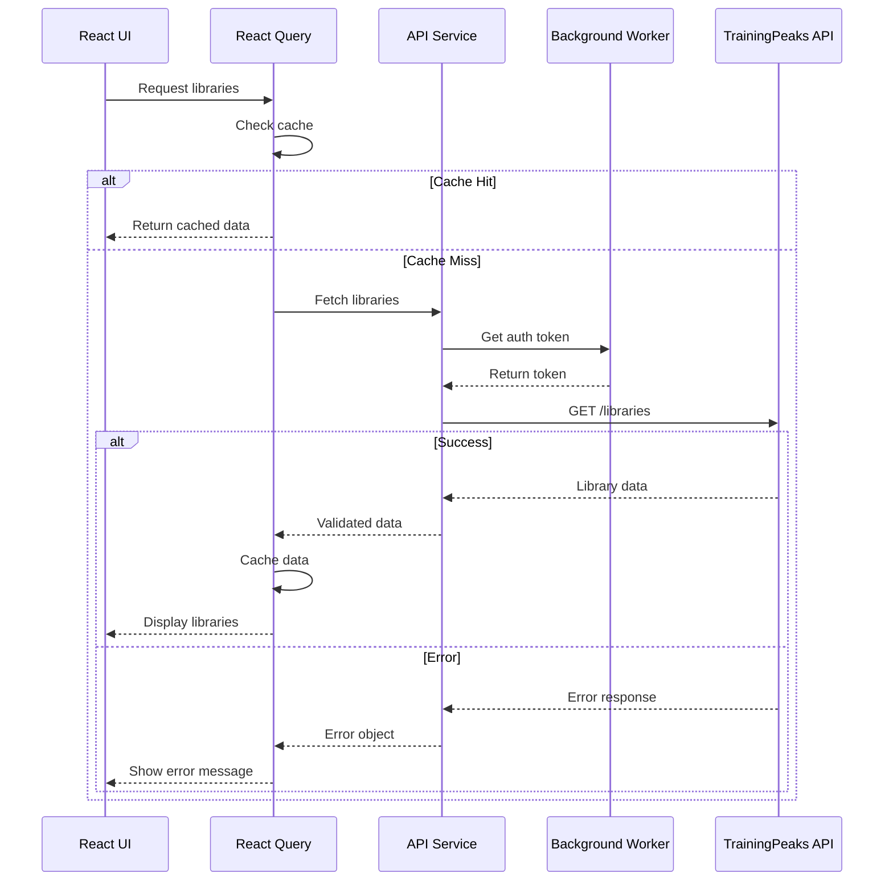

# TrainingPeaks Browser Plugin - Technical Architecture

**Issue**: #1
**Version**: 1.0
**Date**: 2026-02-20
**Status**: Architecture Approved

## Table of Contents

- [Executive Summary](#executive-summary)
- [Requirements Analysis](#requirements-analysis)
- [System Architecture](#system-architecture)
- [Technology Stack](#technology-stack)
- [Implementation Plan](#implementation-plan)
- [Architecture Decision Records](#architecture-decision-records)
- [Risk Assessment](#risk-assessment)
- [Project Structure](#project-structure)
- [Security Considerations](#security-considerations)
- [Testing Strategy](#testing-strategy)
- [Distribution Process](#distribution-process)
- [Future Enhancements](#future-enhancements)

---

## Executive Summary

This document outlines the technical architecture for a Chromium browser extension that integrates with TrainingPeaks to provide access to workout libraries. The plugin leverages existing authenticated browser sessions to fetch user data and exercise libraries through TrainingPeaks API endpoints.

### Key Architectural Highlights

- **Platform**: Chrome Extension (Manifest V3)
- **Tech Stack**: Vite + TypeScript + React + @crxjs/vite-plugin
- **Authentication**: Token extraction via content script interception
- **State Management**: Zustand + React Query
- **Testing**: Playwright (E2E) + Vitest (Unit/Integration)
- **Distribution**: Unlisted Chrome Web Store listing
- **Timeline**: 6-week implementation plan

---

## Requirements Analysis

### Functional Requirements

#### FR1: Authentication Detection
- **Description**: Plugin must detect if user is logged into TrainingPeaks
- **Acceptance Criteria**:
  - Detect bearer token from existing browser session
  - Display authenticated state in UI
  - Handle unauthenticated state gracefully
  - Provide clear messaging when not logged in

#### FR2: API Access
- **Description**: Fetch data from TrainingPeaks API endpoints
- **Endpoints**:
  1. `GET /users/v3/user` - User profile information
  2. `GET /exerciselibrary/v2/libraries` - List of exercise libraries
  3. `GET /exerciselibrary/v2/libraries/{id}/items` - Library content
- **Acceptance Criteria**:
  - Successfully authenticate with bearer token
  - Handle API errors and rate limiting
  - Parse and validate API responses
  - Cache responses appropriately

#### FR3: Library Display (Milestone 1)
- **Description**: Display available exercise libraries to the user
- **Acceptance Criteria**:
  - Show library names and owners
  - Display library count
  - Handle empty library states
  - Provide loading states during fetch

#### FR4: Multi-User Distribution
- **Description**: Package and distribute plugin to multiple users
- **Acceptance Criteria**:
  - Build production-ready bundle
  - Provide installation instructions
  - Enable sharing mechanism
  - Support multiple simultaneous users

### Non-Functional Requirements

#### NFR1: Browser Compatibility
- **Target**: Chromium-based browsers only
- **Minimum Version**: Chrome 88+ (Manifest V3 support)
- **Testing Browsers**: Chrome, Edge, Brave

#### NFR2: Security
- **Token Storage**: Secure storage using chrome.storage.local
- **Permissions**: Minimal required permissions
- **CSP**: Strict Content Security Policy
- **No Token Leakage**: Never log or expose bearer tokens

#### NFR3: Distribution Model
- **Type**: Private/unlisted distribution
- **Method**: Chrome Web Store (unlisted) or direct ZIP sharing
- **Updates**: Automatic updates when using Web Store
- **Access Control**: Link-based sharing

#### NFR4: Performance
- **Extension Load**: <500ms initialization time
- **Popup Open**: <200ms to display
- **API Calls**: <2 seconds per library fetch
- **Bundle Size**: <2MB total

#### NFR5: Testability
- **Coverage**: >80% code coverage
- **E2E Tests**: Run in authenticated browser context
- **CI/CD**: Automated testing on commits
- **Manual Testing**: Clear test scenarios documented

### Technical Constraints

- **API Base URL**: `https://tpapi.trainingpeaks.com`
- **Required Headers**:
  - `authorization: Bearer {token}`
  - `content-type: application/json`
  - `origin: https://app.trainingpeaks.com`
- **CORS**: Requests must originate from proper context
- **Session Dependency**: User must be logged into TrainingPeaks

---

## System Architecture

### High-Level Architecture



### Component Architecture



### Authentication Flow



### API Communication Flow



---

## Technology Stack

### Core Technologies

#### Vite 7.3.1
**Purpose**: Build tool and development server
**Justification**:
- Lightning-fast HMR (<50ms updates)
- Native ESM support
- Optimized production builds with Rollup
- Excellent TypeScript integration
- Plugin ecosystem for Chrome extensions

**Note**: Vite 8.0 beta is available with Rolldown bundler, but v7.3.1 is recommended for production stability.

**Alternatives Considered**:
- Webpack: More complex configuration, slower dev server
- Parcel: Less control over build process
- esbuild: Minimal ecosystem for extensions

#### TypeScript 5.9
**Purpose**: Type-safe development
**Justification**:
- Catch errors at compile time
- Excellent IDE support and autocomplete
- Self-documenting code via types
- API response type safety
- Refactoring confidence

**Note**: TypeScript 6.0 beta is available (Feb 2026), but v5.9 is the latest stable release. TypeScript 7.0 (rewritten in Go) is coming later in 2026.

**Configuration**:
```json
{
  "strict": true,
  "esModuleInterop": true,
  "skipLibCheck": true,
  "target": "ES2020",
  "module": "ESNext"
}
```

#### React 19.2.4
**Purpose**: UI library
**Justification**:
- Familiar component model
- Large ecosystem of libraries
- Concurrent features for better UX
- Well-tested in extension context
- Strong community support
- Server Components support (if needed in future)
- Improved performance over React 18

**Alternatives Considered**:
- Svelte: Smaller bundle but less extension ecosystem
- Vue: Good option but React more common in extensions
- Vanilla JS: No framework overhead but higher complexity

#### @crxjs/vite-plugin 2.3.0
**Purpose**: Chrome extension development
**Justification**:
- Seamless Vite integration
- Automatic manifest generation
- HMR for extension development
- TypeScript manifest support
- Active maintenance

**Important**: Must install with `@latest` flag to avoid cached versions

### State Management

#### Zustand 5.0.11
**Purpose**: Client state management
**Justification**:
- Minimal bundle size (1KB)
- Simple API, low learning curve
- No boilerplate (vs Redux)
- React hooks integration
- Excellent TypeScript support
- Active maintenance with recent updates

**Usage**:
- Authentication state
- UI state (loading, errors)
- User preferences
- Token management

#### TanStack Query (React Query) 5.90.21
**Purpose**: Server state management
**Justification**:
- Built-in caching with smart invalidation
- Automatic background refetching
- Loading and error states
- Request deduplication
- Optimistic updates support
- Compatible with React 19.2.4

**Package**: `@tanstack/react-query`

**Usage**:
- API data fetching
- Library list caching
- Library content caching
- User info caching

### Supporting Libraries

#### Zod 4.3.6
**Purpose**: Runtime validation
**Justification**:
- Type-safe schema validation
- API response validation
- Excellent TypeScript inference
- Clear error messages
- Composable schemas
- **Performance**: 14x faster string parsing, 7x faster array parsing vs Zod 3
- **Bundle Size**: @zod/mini available at ~1.9KB gzipped

**Usage**:
```typescript
const LibrarySchema = z.object({
  id: z.number(),
  name: z.string(),
  owner: z.string(),
  itemCount: z.number().optional()
});
```

#### Tailwind CSS 4.1
**Purpose**: Styling
**Justification**:
- Rapid development
- Small bundle with purging
- Consistent design system
- No naming conflicts
- Responsive utilities
- **Performance**: Up to 5x faster builds, 100x faster incremental builds
- **Modern CSS**: Cascade layers, @property, color-mix()
- **CSS-First Config**: Uses @theme directive instead of JavaScript config

**Browser Support**: Safari 16.4+, Chrome 111+, Firefox 128+

**Configuration**:
- Custom color palette
- Extension-specific utilities
- Dark mode support (future)

### Development & Testing

#### Playwright 1.58.2
**Purpose**: E2E testing
**Justification**:
- Browser extension support
- Authenticated session testing
- Headless and headed modes
- Auto-wait and retry logic
- Screenshot and video capture
- **New in 1.58**: Token-efficient CLI mode, improved HTML reports with Speedboard
- Uses Chrome for Testing builds for consistency

**Test Scenarios**:
- Login detection
- Library fetching
- Error handling
- Token expiration

#### Vitest 4.0.18
**Purpose**: Unit and integration testing
**Justification**:
- Native Vite integration
- Fast execution with ESM
- Jest-compatible API
- Built-in coverage
- Component testing support
- **New in v4**: Stable Browser Mode, Visual Regression testing support, Playwright Traces

**Coverage Targets**:
- API services: >90%
- React components: >80%
- Utilities: >95%
- Overall: >80%

**Growth**: 17M weekly downloads (Feb 2026)

#### TypeScript ESLint & Prettier
**Purpose**: Code quality
**Justification**:
- Consistent code style
- Catch common errors
- Enforce best practices
- Auto-formatting

---

## Implementation Plan

### Timeline: 6 Weeks

### Week 1: Project Setup & Foundation

**Tasks**:
1. Initialize Vite project with TypeScript template
2. Install and configure @crxjs/vite-plugin
3. Set up manifest.json (Manifest V3)
4. Configure TypeScript, ESLint, Prettier
5. Create project folder structure
6. Set up Git hooks (Husky)
7. Initialize package.json with all dependencies

**Deliverables**:
- Working Vite development server
- Extension loads in Chrome
- Basic popup displays "Hello World"
- Hot reload working

**Acceptance Criteria**:
- ✓ `npm run dev` starts dev server
- ✓ Extension loads without errors
- ✓ TypeScript compilation successful
- ✓ Linting passes

---

### Week 2: Authentication & Token Management

**Tasks**:
1. Implement content script for token interception
2. Create authentication service
3. Set up chrome.storage for token persistence
4. Implement token extraction logic
5. Create Zustand auth store
6. Build auth status UI component
7. Add messaging between content script and background

**Deliverables**:
- Content script intercepts TrainingPeaks requests
- Bearer token extracted and stored
- Auth state reflected in UI
- Token refresh mechanism

**Acceptance Criteria**:
- ✓ Token extracted from TrainingPeaks session
- ✓ Auth state persists across browser restarts
- ✓ UI shows logged in/out state
- ✓ Token securely stored

---

### Week 3: API Integration

**Tasks**:
1. Create TypeScript interfaces for all API responses
2. Implement API service layer
3. Set up React Query configuration
4. Implement user info fetch (`/users/v3/user`)
5. Implement libraries list fetch (`/exerciselibrary/v2/libraries`)
6. Implement library items fetch (`/exerciselibrary/v2/libraries/{id}/items`)
7. Add Zod schemas for response validation
8. Implement error handling and retry logic

**Deliverables**:
- Complete API service with all 3 endpoints
- Type-safe API responses
- Error handling for common scenarios
- React Query integration

**Acceptance Criteria**:
- ✓ All 3 API endpoints working
- ✓ Responses validated with Zod
- ✓ Error states handled gracefully
- ✓ Network errors retry automatically

---

### Week 4: UI Development

**Tasks**:
1. Design library list component
2. Implement library card UI
3. Add loading skeletons
4. Create error state components
5. Implement empty state UI
6. Add Tailwind CSS configuration
7. Create responsive layout
8. Add user info display

**Deliverables**:
- Complete library list UI
- Loading and error states
- Responsive design
- Polished user experience

**Acceptance Criteria**:
- ✓ Libraries display correctly
- ✓ Loading states smooth
- ✓ Error messages clear and actionable
- ✓ UI responsive and accessible

---

### Week 5: Testing Infrastructure

**Tasks**:
1. Set up Vitest configuration
2. Write unit tests for API services
3. Write unit tests for utilities
4. Set up React Testing Library
5. Write component tests
6. Configure Playwright for E2E
7. Write E2E test scenarios
8. Set up authenticated test context
9. Configure code coverage reporting
10. Set up CI/CD pipeline (GitHub Actions)

**Deliverables**:
- Comprehensive test suite
- >80% code coverage
- E2E tests running in authenticated context
- CI/CD pipeline

**Acceptance Criteria**:
- ✓ All tests passing
- ✓ Coverage >80%
- ✓ E2E tests work in authenticated browser
- ✓ CI runs on every commit

---

### Week 6: Distribution & Documentation

**Tasks**:
1. Create production build configuration
2. Optimize bundle size
3. Create ZIP distribution script
4. Write installation instructions
5. Create user documentation
6. Set up Chrome Web Store listing (unlisted)
7. Write developer documentation
8. Create changelog
9. Final QA testing
10. Release v1.0

**Deliverables**:
- Production-ready build
- Installation guide
- User documentation
- Chrome Web Store listing
- Release package

**Acceptance Criteria**:
- ✓ Bundle size <2MB
- ✓ Extension works on fresh install
- ✓ Documentation complete
- ✓ Ready for distribution

---

## Architecture Decision Records

### ADR-001: Use Manifest V3

**Status**: Accepted
**Date**: 2026-02-20

**Context**:
Chrome is deprecating Manifest V2 extensions. All new extensions should use Manifest V3.

**Decision**:
Build the extension using Manifest V3 from the start.

**Consequences**:
- **Positive**:
  - Future-proof extension
  - Access to latest Chrome APIs
  - Better security model
  - Service workers instead of background pages
- **Negative**:
  - Cannot use remote code execution
  - More restrictive CSP
  - Service worker lifecycle management

**Alternatives Considered**:
- Manifest V2: Deprecated, would require migration later

---

### ADR-002: Token Extraction via Content Script

**Status**: Accepted
**Date**: 2026-02-20

**Context**:
Need to access bearer token from TrainingPeaks authenticated session without requiring user to manually copy/paste.

**Decision**:
Use a content script to intercept fetch/XHR requests on `app.trainingpeaks.com` and extract the bearer token from Authorization headers.

**Consequences**:
- **Positive**:
  - Seamless user experience
  - No manual token copying
  - Automatic token updates
  - Works with existing sessions
- **Negative**:
  - Requires content script injection
  - Depends on TrainingPeaks request patterns
  - May break if TP changes auth flow

**Alternatives Considered**:
- Manual token input: Poor UX
- OAuth flow: TP doesn't provide OAuth for extensions
- Cookies: More complex and less reliable

**Implementation**:
```javascript
// content-script.ts
const originalFetch = window.fetch;
window.fetch = function(...args) {
  const [url, options] = args;
  if (options?.headers?.authorization) {
    chrome.runtime.sendMessage({
      type: 'TOKEN_FOUND',
      token: options.headers.authorization
    });
  }
  return originalFetch.apply(this, args);
};
```

---

### ADR-003: Zustand for State Management

**Status**: Accepted
**Date**: 2026-02-20

**Context**:
Need state management for client-side state (auth, UI, preferences).

**Decision**:
Use Zustand for lightweight state management.

**Consequences**:
- **Positive**:
  - Minimal bundle size (1KB)
  - Simple API, low learning curve
  - No boilerplate
  - TypeScript support
  - React hooks integration
- **Negative**:
  - Less ecosystem than Redux
  - No built-in DevTools (available via middleware)

**Alternatives Considered**:
- Redux Toolkit: Heavy bundle, unnecessary complexity
- Context API: Performance issues with frequent updates
- Jotai/Recoil: Atom-based model unnecessary for simple state

**Implementation**:
```typescript
interface AuthState {
  token: string | null;
  isAuthenticated: boolean;
  setToken: (token: string) => void;
  clearToken: () => void;
}

const useAuthStore = create<AuthState>((set) => ({
  token: null,
  isAuthenticated: false,
  setToken: (token) => set({ token, isAuthenticated: true }),
  clearToken: () => set({ token: null, isAuthenticated: false })
}));
```

---

### ADR-004: React Query for Server State

**Status**: Accepted
**Date**: 2026-02-20

**Context**:
Need to manage server state (API responses) with caching, loading states, and error handling.

**Decision**:
Use React Query (TanStack Query) for server state management.

**Consequences**:
- **Positive**:
  - Built-in caching with smart invalidation
  - Automatic background refetching
  - Loading and error states
  - Request deduplication
  - Optimistic updates
  - Retry logic
- **Negative**:
  - Additional bundle size (~12KB)
  - Learning curve for advanced features

**Alternatives Considered**:
- SWR: Similar features, less feature-complete
- Custom hooks: Reinventing the wheel
- Zustand only: No built-in caching or request management

**Configuration**:
```typescript
const queryClient = new QueryClient({
  defaultOptions: {
    queries: {
      staleTime: 5 * 60 * 1000, // 5 minutes
      cacheTime: 10 * 60 * 1000, // 10 minutes
      retry: 2,
      refetchOnWindowFocus: false
    }
  }
});
```

---

### ADR-005: Unlisted Chrome Web Store Distribution

**Status**: Accepted
**Date**: 2026-02-20

**Context**:
Need private distribution mechanism for multiple users without public listing.

**Decision**:
Use Chrome Web Store unlisted listing for distribution.

**Consequences**:
- **Positive**:
  - Automatic updates for users
  - No developer mode required
  - Chrome security review
  - Easy sharing via link
  - Professional distribution
- **Negative**:
  - One-time review process
  - $5 developer registration fee
  - Must comply with Chrome policies
  - Review time (1-3 days)

**Alternatives Considered**:
- Direct ZIP sharing: No automatic updates, requires developer mode
- Private server: Complex distribution, security concerns
- GitHub Releases: Still requires developer mode

**Distribution Flow**:
1. Build production bundle
2. Submit to Chrome Web Store as unlisted
3. Wait for review (1-3 days)
4. Share unlisted link with users
5. Users install with one click

---

### ADR-006: Playwright for E2E Testing

**Status**: Accepted
**Date**: 2026-02-20

**Context**:
Need E2E testing that can run in authenticated TrainingPeaks browser session.

**Decision**:
Use Playwright for E2E testing with browser extension support.

**Consequences**:
- **Positive**:
  - Browser extension testing support
  - Can maintain authenticated sessions
  - Auto-wait and retry logic
  - Parallel test execution
  - Screenshot and video capture
  - Cross-browser testing
- **Negative**:
  - Heavier than unit tests
  - Requires browser automation
  - Longer test execution time

**Alternatives Considered**:
- Puppeteer: Less extension support
- Selenium: Slower, more complex setup
- Cypress: Poor extension support

**Test Setup**:
```typescript
import { test, chromium } from '@playwright/test';

test('fetch libraries when authenticated', async () => {
  const pathToExtension = path.join(__dirname, '../dist');
  const context = await chromium.launchPersistentContext('', {
    headless: false,
    args: [
      `--disable-extensions-except=${pathToExtension}`,
      `--load-extension=${pathToExtension}`
    ]
  });

  // Test authenticated flow
  const page = await context.newPage();
  await page.goto('https://app.trainingpeaks.com');
  // ... rest of test
});
```

---

## Risk Assessment

### High Priority Risks

#### Risk 1: Token Expiration
**Probability**: High
**Impact**: High
**Description**: Bearer tokens expire after some period (unknown). If token expires, API calls will fail.

**Mitigation**:
- Implement 401 error detection
- Prompt user to refresh TrainingPeaks session
- Add token refresh mechanism
- Display clear error messages
- Cache last working token timestamp

**Contingency**:
- Fall back to manual token input
- Add "Refresh Authentication" button

---

#### Risk 2: TrainingPeaks API Changes
**Probability**: Medium
**Impact**: High
**Description**: TrainingPeaks may change API endpoints, response formats, or authentication mechanisms without notice.

**Mitigation**:
- Use Zod validation to catch schema changes
- Implement version detection
- Add API health checks
- Monitor for validation errors
- Set up error alerting

**Contingency**:
- Quick patch release process
- Graceful degradation for missing fields
- Error reporting to developers

---

#### Risk 3: CORS and CSP Restrictions
**Probability**: Medium
**Impact**: High
**Description**: Chrome extension CSP or TrainingPeaks CORS policies may block API requests.

**Mitigation**:
- Use background service worker for API calls
- Declare proper host permissions in manifest
- Test CORS thoroughly during development
- Use proper request headers

**Manifest Configuration**:
```json
{
  "host_permissions": [
    "https://tpapi.trainingpeaks.com/*",
    "https://app.trainingpeaks.com/*"
  ],
  "content_security_policy": {
    "extension_pages": "script-src 'self'; object-src 'self'"
  }
}
```

---

### Medium Priority Risks

#### Risk 4: Chrome Extension Policy Violations
**Probability**: Low
**Impact**: High
**Description**: Extension may violate Chrome Web Store policies, leading to rejection or removal.

**Mitigation**:
- Review Chrome extension policies thoroughly
- Minimal permissions requested
- Clear privacy policy
- No data collection without consent
- Transparent about functionality

**Policy Compliance Checklist**:
- ✓ Single purpose extension
- ✓ Minimal permissions
- ✓ Privacy policy provided
- ✓ No remote code execution
- ✓ Secure data handling

---

#### Risk 5: Large Library Performance
**Probability**: Medium
**Impact**: Medium
**Description**: Libraries with thousands of workouts may cause performance issues or slow loading.

**Mitigation**:
- Implement pagination for large libraries
- Virtual scrolling for long lists
- Lazy loading of library content
- Caching of library metadata
- Performance monitoring

**Performance Targets**:
- Libraries list: <2 seconds
- Large library (1000+ items): <5 seconds
- UI interaction: <100ms response

---

#### Risk 6: Race Conditions in Token Extraction
**Probability**: Medium
**Impact**: Medium
**Description**: Content script may not capture token before user opens popup.

**Mitigation**:
- Implement retry mechanism
- Show loading state while waiting for token
- Add manual "Retry Authentication" button
- Store token persistently
- Background token refresh

**User Experience**:
1. User opens popup
2. If no token: Show "Authenticating..." spinner
3. If token found: Proceed with API calls
4. If timeout: Show "Please visit TrainingPeaks" message

---

### Low Priority Risks

#### Risk 7: Browser Compatibility Issues
**Probability**: Low
**Impact**: Low
**Description**: Extension may have issues on different Chromium browsers (Edge, Brave, etc.).

**Mitigation**:
- Test on Chrome, Edge, Brave
- Use standard Chrome APIs only
- Follow Manifest V3 best practices
- Document browser requirements

**Supported Browsers**:
- Chrome 88+
- Edge 88+
- Brave (latest)

---

#### Risk 8: Bundle Size Bloat
**Probability**: Low
**Impact**: Low
**Description**: Dependencies may cause bundle size to exceed reasonable limits.

**Mitigation**:
- Monitor bundle size in CI
- Use tree-shaking
- Lazy load components
- Minimize dependencies
- Regular bundle analysis

**Bundle Budget**:
- Total: <2MB
- Main chunk: <500KB
- Vendor chunk: <1MB
- Assets: <500KB

---

## Project Structure

```
cycling_coach_browser_plugin/
├── src/
│   ├── background/
│   │   ├── index.ts              # Service worker entry point
│   │   ├── messageHandler.ts     # Message routing
│   │   └── api/
│   │       ├── trainingPeaks.ts  # API client
│   │       └── types.ts          # API type definitions
│   ├── content/
│   │   ├── tokenInterceptor.ts   # Token extraction script
│   │   └── injected.ts           # Injected script for XHR interception
│   ├── popup/
│   │   ├── App.tsx               # Main popup component
│   │   ├── main.tsx              # Popup entry point
│   │   ├── index.html            # Popup HTML
│   │   └── components/
│   │       ├── AuthStatus.tsx    # Authentication display
│   │       ├── LibraryList.tsx   # Libraries list
│   │       ├── LibraryCard.tsx   # Individual library card
│   │       ├── ErrorState.tsx    # Error UI
│   │       └── LoadingState.tsx  # Loading skeleton
│   ├── services/
│   │   ├── authService.ts        # Authentication logic
│   │   ├── storageService.ts     # Chrome storage wrapper
│   │   └── apiService.ts         # API request layer
│   ├── store/
│   │   ├── authStore.ts          # Zustand auth store
│   │   └── types.ts              # Store type definitions
│   ├── hooks/
│   │   ├── useAuth.ts            # Auth hook
│   │   ├── useLibraries.ts       # Libraries query hook
│   │   └── useUser.ts            # User info query hook
│   ├── schemas/
│   │   ├── user.schema.ts        # Zod user schema
│   │   ├── library.schema.ts     # Zod library schema
│   │   └── api.schema.ts         # Common API schemas
│   ├── types/
│   │   ├── index.ts              # Exported types
│   │   ├── api.types.ts          # API response types
│   │   └── chrome.types.ts       # Chrome API extensions
│   ├── utils/
│   │   ├── constants.ts          # App constants
│   │   ├── logger.ts             # Logging utility
│   │   └── validators.ts         # Validation helpers
│   └── styles/
│       └── globals.css           # Global styles + Tailwind
├── public/
│   ├── icons/
│   │   ├── icon16.png
│   │   ├── icon48.png
│   │   └── icon128.png
│   └── manifest.json             # Extension manifest
├── tests/
│   ├── unit/
│   │   ├── services/
│   │   │   ├── authService.test.ts
│   │   │   └── apiService.test.ts
│   │   └── utils/
│   │       └── validators.test.ts
│   ├── integration/
│   │   ├── api.test.ts
│   │   └── auth.test.ts
│   ├── components/
│   │   ├── LibraryList.test.tsx
│   │   └── AuthStatus.test.tsx
│   └── e2e/
│       ├── authenticated.spec.ts
│       ├── unauthenticated.spec.ts
│       └── helpers/
│           └── setup.ts
├── .github/
│   └── workflows/
│       ├── ci.yml                # CI pipeline
│       └── release.yml           # Release automation
├── scripts/
│   ├── build.ts                  # Custom build script
│   └── package.ts                # ZIP packaging script
├── docs/
│   ├── INSTALLATION.md           # Installation guide
│   ├── USER_GUIDE.md             # User documentation
│   └── DEVELOPMENT.md            # Developer guide
├── package.json
├── tsconfig.json
├── vite.config.ts
├── tailwind.config.js
├── playwright.config.ts
├── vitest.config.ts
├── .eslintrc.json
├── .prettierrc
└── README.md
```

---

## Security Considerations

### Token Storage

**Requirement**: Store bearer tokens securely without exposure risk.

**Implementation**:
```typescript
// services/storageService.ts
import { storage } from 'webextension-polyfill';

export const storageService = {
  async setToken(token: string): Promise<void> {
    await storage.local.set({
      auth_token: token,
      token_timestamp: Date.now()
    });
  },

  async getToken(): Promise<string | null> {
    const data = await storage.local.get('auth_token');
    return data.auth_token || null;
  },

  async clearToken(): Promise<void> {
    await storage.local.remove('auth_token');
  }
};
```

**Security Measures**:
- Use `chrome.storage.local` (not `localStorage` or `sessionStorage`)
- Never log tokens to console
- Clear tokens on logout
- No token transmission to third parties
- Token only used for TrainingPeaks API

---

### Minimal Permissions

**Manifest Permissions**:
```json
{
  "permissions": [
    "storage"
  ],
  "host_permissions": [
    "https://tpapi.trainingpeaks.com/*",
    "https://app.trainingpeaks.com/*"
  ]
}
```

**Justification**:
- `storage`: Required for token persistence
- Host permissions: Only TrainingPeaks domains
- No unnecessary permissions requested

---

### Content Security Policy

**CSP Configuration**:
```json
{
  "content_security_policy": {
    "extension_pages": "script-src 'self'; object-src 'self'; connect-src https://tpapi.trainingpeaks.com"
  }
}
```

**Protection Against**:
- XSS attacks
- Code injection
- Remote code execution
- Unauthorized API access

---

### Data Privacy

**Privacy Policy**:
- No user data collection
- No analytics or tracking
- No data transmission to third parties
- Tokens stored locally only
- User can clear data anytime

**User Controls**:
- Clear authentication data
- Uninstall removes all data
- No persistent tracking

---

## Testing Strategy

### Unit Tests (Vitest)

**Target**: Services, utilities, helpers
**Coverage Goal**: >90%

**Test Files**:
```typescript
// tests/unit/services/authService.test.ts
describe('authService', () => {
  test('stores token correctly', async () => {
    await authService.setToken('test-token');
    const token = await authService.getToken();
    expect(token).toBe('test-token');
  });

  test('detects authentication state', async () => {
    await authService.setToken('test-token');
    const isAuth = await authService.isAuthenticated();
    expect(isAuth).toBe(true);
  });
});
```

**What to Test**:
- API service methods
- Storage operations
- Validation functions
- Utility helpers
- Error handling

---

### Component Tests (React Testing Library)

**Target**: React components
**Coverage Goal**: >80%

**Test Files**:
```typescript
// tests/components/LibraryList.test.tsx
describe('LibraryList', () => {
  test('displays libraries correctly', () => {
    const libraries = [
      { id: 1, name: 'My Library', owner: 'John' }
    ];
    render(<LibraryList libraries={libraries} />);
    expect(screen.getByText('My Library')).toBeInTheDocument();
  });

  test('shows loading state', () => {
    render(<LibraryList libraries={[]} isLoading={true} />);
    expect(screen.getByTestId('loading-skeleton')).toBeInTheDocument();
  });
});
```

**What to Test**:
- Component rendering
- User interactions
- Loading states
- Error states
- Conditional rendering

---

### Integration Tests

**Target**: API integration, data flow
**Coverage Goal**: Critical paths

**Test Scenarios**:
```typescript
// tests/integration/api.test.ts
describe('API Integration', () => {
  test('fetches user info with valid token', async () => {
    const token = 'valid-token';
    const userInfo = await apiService.getUserInfo(token);
    expect(userInfo).toHaveProperty('id');
    expect(userInfo).toHaveProperty('email');
  });

  test('handles 401 unauthorized', async () => {
    const token = 'invalid-token';
    await expect(apiService.getUserInfo(token))
      .rejects.toThrow('Unauthorized');
  });
});
```

**What to Test**:
- API request/response cycle
- Error handling
- Token refresh flow
- Cache behavior

---

### E2E Tests (Playwright)

**Target**: Full user workflows
**Coverage Goal**: All critical paths

**Test Scenarios**:
```typescript
// tests/e2e/authenticated.spec.ts
test('complete authenticated workflow', async ({ page, context }) => {
  // 1. Navigate to TrainingPeaks
  await page.goto('https://app.trainingpeaks.com');

  // 2. Wait for authentication
  await page.waitForSelector('[data-testid="user-menu"]');

  // 3. Open extension popup
  const popup = await openExtensionPopup(context);

  // 4. Verify auth status
  await expect(popup.locator('[data-testid="auth-status"]'))
    .toContainText('Authenticated');

  // 5. Wait for libraries to load
  await popup.waitForSelector('[data-testid="library-list"]');

  // 6. Verify libraries displayed
  const libraries = await popup.locator('[data-testid="library-card"]').count();
  expect(libraries).toBeGreaterThan(0);
});
```

**Test Coverage**:
- Authenticated user flow
- Unauthenticated user flow
- Token expiration handling
- API error scenarios
- UI interactions

---

### CI/CD Pipeline

**GitHub Actions Workflow**:
```yaml
name: CI

on: [push, pull_request]

jobs:
  test:
    runs-on: ubuntu-latest
    steps:
      - uses: actions/checkout@v3
      - uses: actions/setup-node@v3
        with:
          node-version: 18
      - run: npm ci
      - run: npm run lint
      - run: npm run type-check
      - run: npm run test:unit
      - run: npm run test:components
      - run: npm run build

  e2e:
    runs-on: ubuntu-latest
    steps:
      - uses: actions/checkout@v3
      - uses: actions/setup-node@v3
      - run: npm ci
      - run: npx playwright install
      - run: npm run test:e2e
```

---

## Distribution Process

### Development Distribution (Phase 1)

**Method**: Direct ZIP sharing
**Process**:
1. Build production bundle: `npm run build`
2. Package extension: `npm run package` (creates `dist.zip`)
3. Share ZIP file with users
4. Users load unpacked extension in Chrome

**Installation Steps for Users**:
1. Download `dist.zip`
2. Extract to local folder
3. Open `chrome://extensions`
4. Enable "Developer mode"
5. Click "Load unpacked"
6. Select extracted folder

**Pros**:
- Quick distribution
- No review process
- Full control

**Cons**:
- Requires developer mode
- No automatic updates
- Less professional

---

### Production Distribution (Phase 2)

**Method**: Chrome Web Store (Unlisted)
**Process**:

#### 1. Prepare Release
```bash
npm run build
npm run package
# Creates: cycling-coach-plugin-v1.0.0.zip
```

#### 2. Chrome Web Store Setup
- Create Chrome Web Store developer account ($5 one-time fee)
- Create new extension listing
- Upload ZIP file
- Set visibility to "Unlisted"

#### 3. Listing Details
- **Title**: TrainingPeaks Library Access
- **Description**: Access your TrainingPeaks workout libraries directly from your browser
- **Category**: Productivity
- **Language**: English
- **Privacy Policy**: Include privacy policy URL

#### 4. Store Assets
- Icon: 128x128px PNG
- Screenshots: 1280x800px (at least 1)
- Promotional tile: 440x280px (optional)

#### 5. Privacy Practices
- Single purpose: Access TrainingPeaks libraries
- Permissions justification: Document why each permission is needed
- Data usage: No data collection or transmission

#### 6. Submit for Review
- Review time: 1-3 business days
- Address any review feedback
- Publish once approved

#### 7. Share with Users
- Get unlisted listing URL
- Share URL via email/docs
- Users install with one click

**Pros**:
- Automatic updates
- No developer mode needed
- Professional distribution
- Chrome security review

**Cons**:
- Review process (1-3 days)
- Must comply with policies
- $5 registration fee

---

### Update Process

**For ZIP Distribution**:
1. Build new version
2. Update version in `manifest.json`
3. Create new ZIP
4. Notify users to reinstall

**For Web Store Distribution**:
1. Update version in `manifest.json`
2. Build and package
3. Upload to Web Store
4. Users receive automatic update

**Version Numbering**:
- Follow Semantic Versioning (semver)
- Format: `MAJOR.MINOR.PATCH`
- Example: `1.0.0` → `1.1.0` (new features) → `1.1.1` (bug fixes)

---

## Future Enhancements

### Phase 1.1 (Post-Launch)

**Priority**: High
**Timeline**: 2-4 weeks after v1.0

**Features**:
1. **Library Search/Filter**
   - Search workouts by name
   - Filter by workout type
   - Sort by date/name

2. **Workout Details View**
   - Click library item to view details
   - Display workout structure
   - Show workout description

3. **Favorite Libraries**
   - Mark libraries as favorites
   - Quick access to favorite libraries
   - Persist favorites in storage

4. **Offline Mode**
   - Cache library data
   - Work without internet connection
   - Sync when connection restored

---

### Phase 2.0 (Major Update)

**Priority**: Medium
**Timeline**: 3-6 months after v1.0

**Features**:
1. **Workout Export**
   - Export workouts to various formats (TCX, ZWO, MRC)
   - Bulk export capabilities
   - Custom export templates

2. **Calendar Integration**
   - View scheduled workouts
   - Sync with TrainingPeaks calendar
   - Add workouts to calendar

3. **Multi-Account Support**
   - Switch between TP accounts
   - Coach accounts with athlete access
   - Multiple profile management

4. **Advanced Analytics**
   - Workout statistics
   - Library usage analytics
   - Workout difficulty analysis

5. **Dark Mode**
   - Dark theme UI
   - System theme detection
   - Theme toggle in settings

---

### Phase 3.0 (Advanced Features)

**Priority**: Low
**Timeline**: 6-12 months after v1.0

**Features**:
1. **AI Workout Recommendations**
   - Suggest similar workouts
   - Workout difficulty assessment
   - Training plan suggestions

2. **Social Features**
   - Share libraries with others
   - Community library marketplace
   - Workout reviews and ratings

3. **Mobile Companion**
   - React Native mobile app
   - Sync with browser extension
   - Offline workout access

4. **Custom Workout Builder**
   - Build workouts in extension
   - Upload to TrainingPeaks
   - Workout templates

---

## Appendix

### API Response Examples

#### User Response
```json
{
  "id": 12345,
  "email": "user@example.com",
  "firstName": "John",
  "lastName": "Doe",
  "timeZone": "America/New_York"
}
```

#### Libraries Response
```json
[
  {
    "id": 1,
    "name": "My Workouts",
    "ownerId": 12345,
    "ownerName": "John Doe",
    "itemCount": 150,
    "isShared": false
  }
]
```

#### Library Items Response
```json
{
  "items": [
    {
      "id": 101,
      "name": "Sweet Spot 2x10",
      "description": "2x10min @ 88-93% FTP",
      "type": "bike",
      "duration": 3600,
      "structure": { /* workout structure */ }
    }
  ]
}
```

---

### Glossary

- **Bearer Token**: Authentication token passed in HTTP Authorization header
- **Chrome Extension**: Browser add-on that extends Chrome functionality
- **Content Script**: JavaScript that runs in web page context
- **E2E Testing**: End-to-end testing of complete user workflows
- **Manifest V3**: Latest Chrome extension platform version
- **Service Worker**: Background script for extensions (replaces background pages)
- **TrainingPeaks**: Online training platform for endurance athletes
- **XHR**: XMLHttpRequest, method for making HTTP requests

---

### References

- [Chrome Extension Documentation](https://developer.chrome.com/docs/extensions/)
- [Manifest V3 Migration Guide](https://developer.chrome.com/docs/extensions/mv3/intro/)
- [TrainingPeaks API](https://tpapi.trainingpeaks.com/) (inferred from endpoints)
- [React Query Documentation](https://tanstack.com/query/latest)
- [Zustand Documentation](https://github.com/pmndrs/zustand)
- [Playwright Documentation](https://playwright.dev/)
- [Vite Documentation](https://vitejs.dev/)

---

**Document Version**: 1.0
**Last Updated**: 2026-02-20
**Next Review**: After Phase 1 completion
