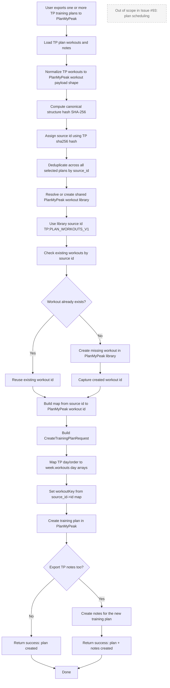

# PlanMyPeak Training Plan Export Flow (Issue #93)

Source of truth: `PlanMyPeak/workouts-openapi.yaml`

Scope for this flow:

- Include training plan creation and optional note creation.
- Do not schedule plan instances.

## Endpoint groups used

- Workouts/libraries: `/api/v1/workouts/*`
- Training plans/notes: `/api/training-plans*`

## Key implementation rule

- Dedup key is `source_id` with format `TP:{sha256_of_workout_structure}`.
- Shared import library key is `source_id = TP:PLAN_WORKOUTS_V1`.
